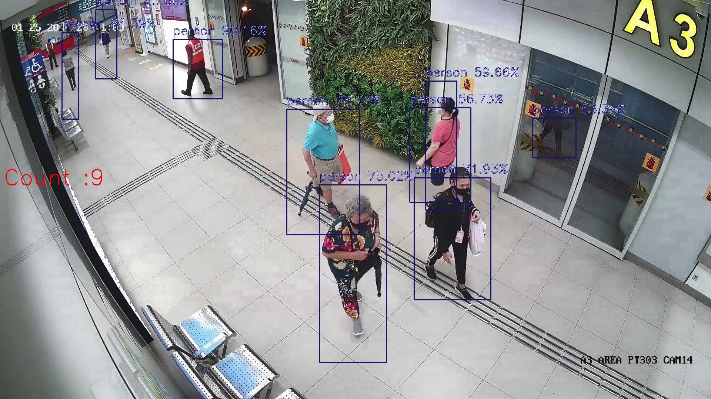

# CrowdCounting

Crowd Counting is a very interesting problem. 

Can we find out how many people are there in this particular picture?

This is done via Machine Learning, via training of Artificial neural network. 
In the four levels of analytics:

- Descriptive
- Diagnostic
- Predictive
- Prescriptive

This will be classified as Predictive Analytics. We are predicting the object identity whether a person was found using trained model of pictures of many people.
